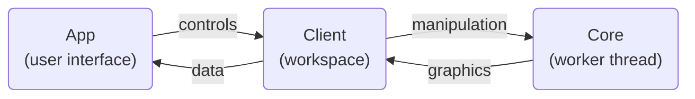

# Contributing Guidelines

BP Studio is developed using [VS Code](https://code.visualstudio.com/),
and the project folder is already configured for it.

## Contributing new languages

If you would like to contribute a new language, start with `src/locale/en.json` and translate it.
You will find the VS Code extension [i18n Ally](https://marketplace.visualstudio.com/items?itemName=antfu.i18n-ally) very helpful.

## Environment and build instructions

To build BP Studio, first you need the following:

1. Install [Node.js](https://nodejs.org/).
1. BP Studio had migrated from NPM to PNPM for package managing, so install [PNPM](https://pnpm.io/) by the command `npm install -g pnpm`.
1. Install [TypeScript](https://www.typescriptlang.org/) globally by the command `pnpm add -g typescript`.
1. Install [Gulp](https://www.npmjs.com/package/gulp) globally by the command `pnpm add -g gulp-cli`.
1. Use the command `pnpm install` under the project root folder to install all dependencies.

And then you can simply press `F5` in VS Code to build and launch the app automatically.
This is the preferred way to launch as it adds additional parameters for launching Chrome to ensure all functionalities work properly in local environment.

Alternatively, run `gulp` (or `gulp default`) to build the entire project manually,
and use any browser to open `debug/index.htm` (or `dist/index.htm` if debug is not needed) to run it.
Some of the features may not work with this approach though.

Typically the default task is sufficient for developing purpose,
and you won't need to execute individual subtask,
as all subtasks will skip themselves if the source files are not changed.
If something goes wrong, you can run `gulp clean` to cleanup built files and then rebuild everything.

## Unit testing

BP Studio specs and tests use [Mocha](https://mochajs.org/).
The preferred way to run them is by using the
[Mocha Test Explorer](https://marketplace.visualstudio.com/items?itemName=hbenl.vscode-mocha-test-adapter) extension of VS Code.
Alternatively, run `pnpm test` in the console to run all tests.

## About the source code organization

BP Studio consists mainly of three parts:
the [App](src/app/README.md),
the [Client](src/client/README.md),
and the [Core](src/core/README.md).
Their relations can be roughly depicted as follows:

Refer to each of them for more details.

Almost all comments in the source code are written in Chinese,
which is slightly more intuitive for the author's train of thoughts; sorry about that 😅
