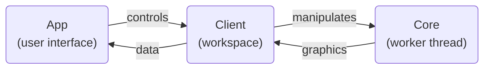

# Contributing Guidelines

While one may use any editors to work with BP Studio,
it is highly recommended to use [VS Code](https://code.visualstudio.com/)
as the project folder is already configured for it.
As you open the project with it,
it will also hint you the recommended extensions to install.

## Contributing new languages

Please refer to the readme of the [Locale](src/locale/README.md) section.

## Environment and build instructions

To build BP Studio, first you need the following:

1. Install or upgrade [Node.js](https://nodejs.org/) to v20+.
1. BP Studio had migrated from NPM to [PNPM](https://pnpm.io/) for package managing,
   so install PNPM by the command `npx pnpm install -g pnpm`.
1. Use the command `pnpm install` under the project root folder to install all dependencies.
1. Run `pnpm gulp` once to create pre-build assets.

And then you can simply press `F5` in VS Code to build and launch the app automatically.
This is the preferred way to launch as it allows debugging in the IDE.

Alternatively, run `pnpm build` to build the entire project manually,
and then run `pnpm preview` to launch the local server on production build.

> Note: one should always run BP Studio through a server,
> as some of the features would not work in `files://` protocol.

## Developing optimizer

The BP Studio optimizer is written in Python as it utilizes [scipy](https://pypi.org/project/scipy/).
In order to have typing supports in VS Code,
you will need [Pylance](https://marketplace.visualstudio.com/items?itemName=ms-python.vscode-pylance) extension,
Python 3.9+ and [pipenv](https://pypi.org/project/pipenv/) installed.
You can then install the dependencies with `pipenv install`.

## Browser compatibility

BP Studio have tried to support as much browser versions as possible,
but there are some essential barriers that cannot be compromised.
First of all, IE is obviously not supported as there're way too many modern
features that cannot be used, plus it's REALLY dead by now. And then:

- Firefox < 78 and Safari < 11.1 (or iOS < 11.3) does not support the `s` flag of regular expressions.
See [caniuse](https://caniuse.com/mdn-javascript_builtins_regexp_dotall).
- Chrome < 66 and Opera < 53 does not support `Array.prototype.values`.
See [caniuse](https://caniuse.com/mdn-api_headers_values).

Both these features are used in Vue 3, which is a critical dependency of BP Studio.
The second issue could be polyfilled,
but I see less point in doing so as those versions are old enough already,
while the first issue is impossible to polyfill.

Note that the targeted version almost coincide with the support for
[optional catch binding](https://caniuse.com/mdn-javascript_statements_try_catch_optional_catch_binding),
with Firefox being the only exception.

There's currently no plans for officially supporting browsers other than
Chrome, Edge, Safari, Firefox, Opera, and Samsung Internet.
Not that I don't want to, but that I don't have the resource to do so.

## Automate testing

BP Studio contains three test sets: the [Mocha unit tests](test/README.md),
the [Playwright e2e tests](e2e/README.md),
and the [Python tests](src/client/plugins/optimizer/python/tests/README.md).
Refer to the README of each for details.

## Code styling

This project use [ESLint](https://eslint.org/) for both linting and formatting
(using [@stylistic/eslint-plugin](https://eslint.style/)).
If one opens it with VS Code plus the recommended extensions,
all files will go through auto formatting as one saves them.

## About the source code organization

BP Studio consists mainly of three parts:
the [App](src/app/README.md),
the [Client](src/client/README.md),
and the [Core](src/core/README.md).
Their relations can be roughly depicted as follows:

Refer to the README of each of them through the links above for more details.

**All comments are now in English!**
Feel free to contact me in any part of the code is unclear to you.
