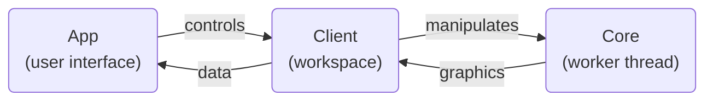

# Contributing Guidelines

BP Studio is developed using [VS Code](https://code.visualstudio.com/),
and the project folder is already configured for it.

## Contributing new languages

Please refer to the readme of the [Locale](src/locale/README.md) section.

## Environment and build instructions

To build BP Studio, first you need the following:

1. Install or upgrade [Node.js](https://nodejs.org/) to v18+.
1. BP Studio had migrated from NPM to [PNPM](https://pnpm.io/) for package managing,
   so install PNPM by the command `npm install -g pnpm`.
1. Use the command `pnpm install` under the project root folder to install all dependencies.

And then you can simply press `F5` in VS Code to build and launch the app automatically.
This is the preferred way to launch as it adds additional parameters for launching Chrome to ensure all functionalities work properly in local environment.

Alternatively, run `pnpm build` to build the entire project manually,
and use any browser to open `debug/index.htm` (or `dist/index.htm` if debug is not needed) to run it.
Some of the features may not work with this approach though.

Typically the default build task is sufficient for developing purpose,
and you won't need to execute individual Gulp subtasks,
as all subtasks will skip themselves if the source files are not changed.
If something goes wrong, you can run `pnpm build clean` to cleanup built files and then rebuild everything.

## Browser compatibility

BP Studio have tried to support as much browser versions as possible,
but there are some essential barriers that cannot be compromised.
First of all, IE is obviously not supported as there're way too many modern
features that cannot be used, plus it's REALLY dead by now. And then:

- Firefox < 78 and Safari < 11.1 (or iOS < 11.3) does not support the `s` flag of regular expressions.
See [caniuse](https://caniuse.com/mdn-javascript_builtins_regexp_dotall).
- Chrome < 66 and Opera < 53 does not support `Array.prototype.values`.
See [caniuse](https://caniuse.com/mdn-api_headers_values).

Both these features are used in Vue 3, which is a critical dependency of BP Studio.
The second issue could be polyfilled,
but I see less point in doing so as those versions are old enough already,
while the first issue is impossible to polyfill.

Note that the targeted version almost coincide with the support for
[optional catch binding](https://caniuse.com/mdn-javascript_statements_try_catch_optional_catch_binding),
with Firefox being the only exception.

There's currently no plans for officially supporting browsers other than
Chrome, Edge, Safari, Firefox, Opera, and Samsung Internet.
Not that I don't want to, but that I don't have the resource to do so.

## Unit testing

Refer to the [README](test/README.md) of tests.

## About the source code organization

BP Studio consists mainly of three parts:
the [App](src/app/README.md),
the [Client](src/client/README.md),
and the [Core](src/core/README.md).
Their relations can be roughly depicted as follows:

Refer to the README of each of them through the links above for more details.

**All comments are now in English!**
Feel free to contact me in any part of the code is unclear to you.
