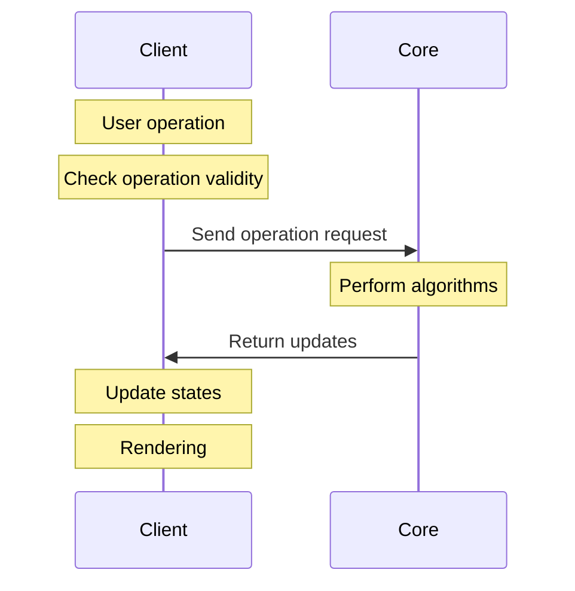

# Client

BP Studio Client is in charge of the workspace area.
It creates a [Core](../core/README.md) worker for each opened project,
handles user interactions and render the graphics using [Pixi.js](https://pixijs.com/).
It is built separately from the [App](../app/README.md) so that the App can be initialized faster.

Notice that we do not install the entire `pixi.js` NPM package,
and instead we install individual packages that are actually used in this project.
This saves about 100KB in the final build size.

The lifecycle between the Client and the Core is depicted as follows.

