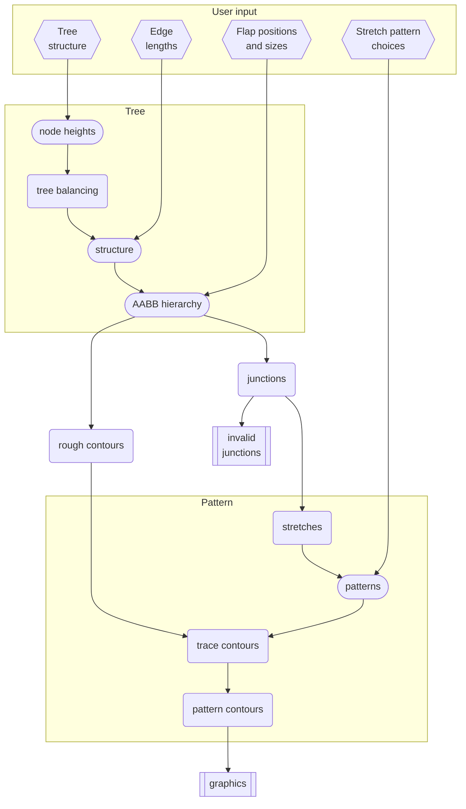

# Core

BP Studio Core is compiled as a web worker that handles a single project.
It receives command from the [Client](../client/README.md)
to mutate the state of the design, process all dependent variables,
and return the difference (`UpdateModel`) to the Client.

Writing the Core as a worker has several benefits:
1. Heavy calculations are done outside the UI thread,
   giving much better rendering performance.
2. Session projects can be loaded in parallel during startup.
3. When a project closes, we can simply terminate the worker and release 
   all memory associated with it, easily preventing all possible memory leaks.

In order to simplify the protocol between the Client and the Core,
the Core will always assume that the command it receives is valid without
checking. Therefore it is the Client's responsibility to ensure the validity of
the commands.

In the far future, the Core may be rewritten as WebAssembly for better
performance, but for foreseeable future this seems unnecessary as the runtime of
the Client exceeds that of the Core anyway.

The data flow of the Core is depicted in the following chart.

