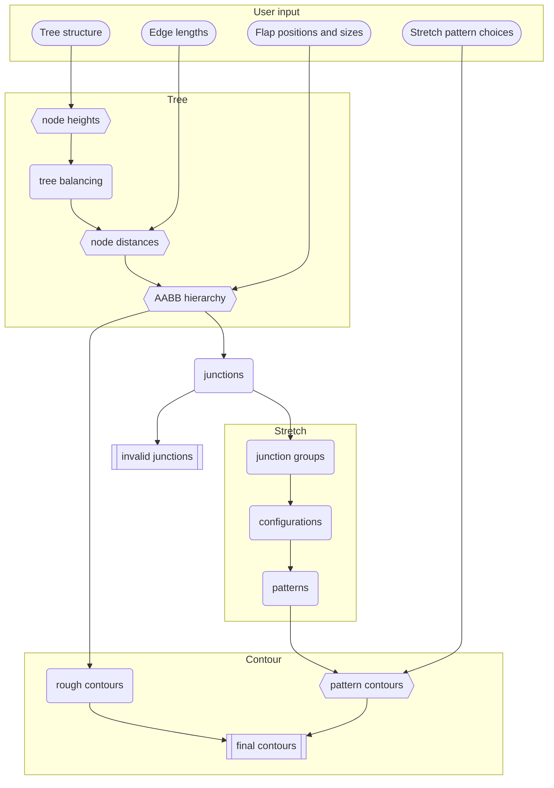

# Core

BP Studio Core is compiled as a web worker that handles a single project.
It's receives command from the [Client](../client/README.md) to mutate the state of the design,
process all dependent variables, and return the difference (`UpdateModel`) to the Client.

In order to simplify the protocol between the Client and the Core,
the Core will always assume that the command it receives is valid without checking.
Therefore it is the Client's responsibility to ensure the validity of the command.

In the future, Core might be rewritten as WebAssembly for better performance.

The data flow of the Core is depicted in the following chart.

